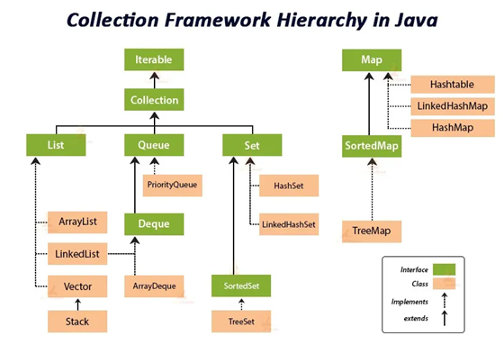

# Collection Framework



The **Java Collection Framework** (JCF) is a set of interfaces and classes in java.util that help store, retrieve, and manipulate groups of objects efficiently.


>A group of objects means multiple objects stored together and treated as one unit.  

```java
//Example
//Suppose you have student names:

Rahul
Aman
Priya
Neha

// If we store them together in a collection:

ArrayList<String> students = new ArrayList<>();

students.add("Rahul");
students.add("Aman");
students.add("Priya");
students.add("Neha");
```

- **Interfaces**: Collection, List, Set, Queue, Map (Map is not a subtype of Collection)
- **Implementations**: ArrayList, LinkedList, HashSet, TreeSet, HashMap, LinkedHashMap, PriorityQueue, etc.
- **Algorithms**: Sorting, searching, shuffling via Collections utility class.


## Hierarchy Overview
Collection (Interface)  
├── List (Interface) → ArrayList, LinkedList, Vector, Stack  
├── Set (Interface) → HashSet, LinkedHashSet, TreeSet  
└── Queue (Interface) → PriorityQueue, ArrayDeque

Map (Interface) → HashMap, LinkedHashMap, TreeMap, Hashtable


# List (Interface)
The List interface is used to store a collection of elements in an ordered way where duplicates are allowed and elements can be accessed using an index.  
```java
// Implementation way 
ArrayList
LinkedList
Vector
Stack
```


# ArrayList
ArrayList is a resizable array used to store a group of objects in sequence in Java.

### Features of ArrayList

**Dynamic size** – size increases automatically.  
**Maintains insertion order** – elements remain in the order added.  
**Allows duplicate elements.**  
**Index-based access** – elements can be accessed using index numbers.  
**Allows null values.**


# Creation of array list

| Method                             | What it Does                            | Key Difference                              |
| ---------------------------------- | --------------------------------------- | ------------------------------------------- |
| `new ArrayList<>()`                | Creates an empty ArrayList              | Default and simplest way                    |
| `List list = new ArrayList<>()`    | Uses List interface reference           | More flexible (interface-based programming) |
| `new ArrayList<>(capacity)`        | Creates list with initial capacity      | Better performance if size is known         |
| `new ArrayList<>(collection)`      | Copies elements from another collection | Used for cloning or copying lists           |
| `new ArrayList<>(Arrays.asList())` | Converts array values into ArrayList    | Quick initialization with values            |
| `new ArrayList<>(List.of())`       | Creates ArrayList from immutable list   | Used in Java 9+ for fixed values            |


# Methods 
```java
// =========================
// 1️⃣ Adding Elements
// =========================
list.add(element);                   // Add element at the end
list.add(index, element);            // Insert element at specific index
list.addAll(collection);             // Add all elements from another collection
list.addAll(index, collection);      // Insert all elements from another collection starting at given index

// =========================
// 2️⃣ Removing Elements
// =========================
list.remove(index);                  // Remove element at specified index
list.remove(object);                 // Remove first occurrence of the specified object
list.removeIf(predicate);            // Remove elements matching a condition (lambda)
list.removeAll(collection);          // Remove all elements that exist in the specified collection
list.retainAll(collection);          // Keep only elements that exist in the specified collection
list.clear();                        // Remove all elements from the list

// =========================
// 3️⃣ Accessing & Updating Elements
// =========================
list.get(index);                     // Get element at specified index
list.set(index, element);            // Replace element at specified index
list.replaceAll(operator);           // Replace each element using a lambda expression
list.subList(fromIndex, toIndex);    // Return a view of a portion of the list
list.clone();                        // Shallow copy of the ArrayList

// =========================
// 4️⃣ Searching & Checking
// =========================
list.contains(object);               // Check if list contains the element
list.indexOf(object);                // Return the first occurrence index of the element
list.lastIndexOf(object);            // Return the last occurrence index of the element
list.isEmpty();                      // Check if the list has no elements
list.size();                         // Return the number of elements in the list

// =========================
// 5️⃣ Iterating / Traversing
// =========================
list.iterator();                     // Return an Iterator (forward only)
list.listIterator();                 // Return a ListIterator (forward/backward)
list.listIterator(index);            // Return a ListIterator starting at given index
list.forEach(action);                // Loop through list using a lambda expression

// =========================
// 6️⃣ Converting / Streams
// =========================
list.toArray();                      // Convert list to Object[] array
list.toArray(new Type[0]);           // Convert list to typed array (e.g., String[])
list.stream();                       // Create a sequential stream
list.parallelStream();               // Create a parallel stream

// =========================
// 7️⃣ Sorting & Capacity
// =========================
list.sort(comparator);               // Sort list using a comparator
list.ensureCapacity(minCapacity);    // Increase internal capacity in advance
list.trimToSize();                   // Reduce internal array capacity to current size
```


# LinkedList

## 📘 Definition

LinkedList is a class that implements List, Deque, and Queue interfaces and stores elements as nodes, where each node contains:

## 🔑 Key Features of LinkedList

**Doubly linked list** – each element points to next and previous.  
**Implements List, Deque, and Queue** – can be used as list, stack, or queue.  
**Allows duplicate elements and null values.  
Maintains insertion order.  
Efficient insertions and deletions anywhere in the list.  
Slower access by index because traversal is needed**

# way to implement 
```java
LinkedList<String> list = new LinkedList<>();
List<String> list = new LinkedList<>();
LinkedList<String> list2 = new LinkedList<>(list1);
```


# Common LinkedList Methods
```java
// Adding Elements
list.add(element);          // add at end
list.addFirst(element);     // add at beginning
list.addLast(element);      // add at end
list.add(index, element);   // add at specific index

// Removing Elements
list.remove();              // remove first element
list.remove(index);         // remove at index
list.remove(object);        // remove first occurrence
list.removeFirst();         // remove first element
list.removeLast();          // remove last element
list.clear();               // remove all

// Accessing Elements
list.get(index);            // get element at index
list.getFirst();            // get first element
list.getLast();             // get last element
list.set(index, element);   // replace element at index

// Queue & Stack Operations
list.offer(element);        // add at end (Queue)
list.poll();                // remove first (Queue)
list.peek();                // get first without removing (Queue)
list.push(element);         // add at front (Stack)
list.pop();                 // remove first (Stack)

// Searching & Checking
list.contains(object);      // check if exists
list.indexOf(object);       // first occurrence
list.lastIndexOf(object);   // last occurrence
list.isEmpty();             // check if empty
list.size();                // number of elements

// Iterating
list.iterator();            // forward iterator
list.descendingIterator();  // backward iterator
list.listIterator();        // bi-directional iterator
list.forEach(action);       // loop with lambda

// Converting
list.toArray();             // Object array
list.toArray(new String[0]); // typed array
list.stream();              // sequential stream
list.parallelStream();      // parallel stream
```


# Vector
## 📘 Definition

Vector is a resizable array that can grow automatically and supports thread-safe operations.    

It was introduced in Java 1.0 (before Collections Framework) and later retrofitted to implement List interface.

## 🔑 Key Features of Vector
**Resizable array** – grows automatically when needed.  
**Synchronized** – safe for multi-threaded use.  
**Allows duplicate elements and null.**  
**Maintains insertion order.**  
**Implements List, RandomAccess, Cloneable, Serializable interfaces.**  
**Slower than ArrayList in single-threaded scenarios due to synchronization overhead**  


# How to Create a Vector
```java
// 1️⃣ Simple Creation
Vector<String> vector = new Vector<>();
// 2️⃣ With Initial Capacity
Vector<Integer> numbers = new Vector<>(10);
// 3️⃣ With Initial Capacity & Capacity Increment
Vector<Integer> numbers = new Vector<>(10, 5); // capacity grows by 5 each time
// 4️⃣ From Another Collection
Vector<String> vector2 = new Vector<>(list1);
```

# Common Vector Methods
```java
// Adding Elements

vector.add(element);          // add at end
vector.add(index, element);   // add at specific index
vector.addAll(collection);    // add all elements from another collection
vector.addElement(element);   // legacy method (same as add)

// Removing Elements
vector.remove();              // remove first element
vector.remove(index);         // remove at index
vector.remove(object);        // remove first occurrence
vector.removeAll(collection); // remove all elements from another collection
vector.clear();               // remove all elements
vector.removeElement(element); // legacy method
vector.removeElementAt(index); // legacy method

// Accessing Elements
vector.get(index);            // get element at index
vector.set(index, element);   // replace element at index
vector.firstElement();        // get first element (legacy)
vector.lastElement();         // get last element (legacy)
vector.elementAt(index);      // get element at index (legacy)

// Searching & Checking
vector.contains(object);      // check if exists
vector.indexOf(object);       // first occurrence
vector.lastIndexOf(object);   // last occurrence
vector.isEmpty();             // check if empty
vector.size();                // number of elements
vector.capacity();            // current capacity

// Iterating
vector.iterator();            // forward iterator
vector.listIterator();        // bi-directional iterator
vector.elements();            // Enumeration (legacy)
vector.forEach(action);       // loop with lambda

// Converting
vector.toArray();             // Object array
vector.toArray(new Type[0]);  // typed array
vector.stream();              // sequential stream
vector.parallelStream();      // parallel stream

// Legacy Queue/Stack Methods
vector.push(element);         // push element at end (stack)
vector.pop();                 // remove and return last element (stack)
vector.peek();                // view last element (stack)
```


# set interface 
## 📘 Definition

Set is an interface in Java Collections Framework that represents a collection of elements with no duplicate values.
It does not maintain insertion order (except some implementations like LinkedHashSet).

# 🔑 Key Characteristics

**No duplicates** – each element is unique.

**No guaranteed order** – elements are not stored in insertion order (unless LinkedHashSet).

**Allows at most one null element (except TreeSet, which may throw exception for null).**

**Implements Collection interface** – inherits methods like add(), remove(), contains().

# 📦 Common Classes that Implement Set

| Class           | Features                                                 |
| --------------- | -------------------------------------------------------- |
| `HashSet`       | Stores elements in **hash table**; no order; allows null |
| `LinkedHashSet` | Maintains **insertion order**; allows null               |
| `TreeSet`       | Stores elements in **sorted order**; no null allowed     |


# HashSet
## 📘 Definition


HashSet is a collection that implements Set and stores unique elements without any guaranteed order.
It is not synchronized, so it’s faster than Vector in single-threaded scenarios.

## 🔑 Key Features of HashSet

No duplicates – automatically ignores duplicate elements.

No guaranteed order – elements may appear in any order.

Allows one null element.

Implements Set interface – inherits methods like add(), remove(), contains  

Faster operations – add, remove, and contains are O(1) on average.

Not synchronized – not thread-safe (use Collections.synchronizedSet() for thread-safety).


## 📦 How to Create a HashSet

1️⃣ Simple Creation
HashSet<String> set = new HashSet<>();

2️⃣ Using Set Interface
Set<String> set = new HashSet<>();

3️⃣ With Initial Capacity and Load Factor
HashSet<Integer> numbers = new HashSet<>(20, 0.75f);

4️⃣ From Another Collection
HashSet<String> set2 = new HashSet<>(list);


## 📌 Common HashSet Methods
```java
// Adding Elements
set.add(element);           // add element
set.addAll(collection);     // add all elements from another collection

// Removing Elements
set.remove(element);        // remove specific element
set.removeAll(collection);  // remove all elements in another collection
set.retainAll(collection);  // keep only elements present in another collection
set.clear();                // remove all elements

// Checking Elements
set.contains(element);      // check if element exists
set.isEmpty();              // check if set is empty
set.size();                 // number of elements

// Iterating
set.iterator();             // get iterator
set.forEach(action);        // loop with lambda

// Conversion
set.toArray();              // convert to Object array
set.toArray(new Type[0]);   // convert to typed array
set.stream();               // sequential stream
set.parallelStream();       // parallel stream
```

# LinkedHashSet
## 📘 Definition

LinkedHashSet is a hash table and linked list implementation of the Set interface.
It preserves the order in which elements were added, unlike HashSet.

## 🔑 Key Features of LinkedHashSet

No duplicates – duplicate elements are ignored automatically.

Maintains insertion order – elements are returned in the order they were added.

Allows one null element.

Implements Set interface – inherits methods like add(), remove(), contains().

Not synchronized – faster than synchronized collections.

## 📦 How to Create a LinkedHashSet

1️⃣ Simple Creation
LinkedHashSet<String> set = new LinkedHashSet<>();

2️⃣ Using Set Interface
Set<String> set = new LinkedHashSet<>();

3️⃣ From Another Collection
LinkedHashSet<String> set2 = new LinkedHashSet<>(list);

## 📌 Common LinkedHashSet Methods
```java

// Adding Elements
set.add(element);           // add element
set.addAll(collection);     // add all elements from another collection

// Removing Elements
set.remove(element);        // remove specific element
set.removeAll(collection);  // remove all elements from another collection
set.retainAll(collection);  // retain only elements present in another collection
set.clear();                // remove all elements

// Checking Elements
set.contains(element);      // check if element exists
set.isEmpty();              // check if set is empty
set.size();                 // number of elements

// Iterating
set.iterator();             // get iterator
set.forEach(action);        // loop using lambda

// Conversion
set.toArray();              // convert to Object array
set.toArray(new Type[0]);   // convert to typed array
set.stream();               // sequential stream
set.parallelStream();       // parallel stream
```


# TreeSet
## 📘 Definition

TreeSet is a sorted set implementation in Java.
It does not allow duplicates and automatically sorts elements either in natural order or using a custom comparator.

## 🔑 Key Features of TreeSet

No duplicates – duplicate elements are ignored.

Sorted order – elements are automatically sorted.

Does not allow null elements (throws NullPointerException).

Implements NavigableSet and SortedSet interfaces (in addition to Set).

Useful for range operations – supports headSet(), tailSet(), subSet().

Not synchronized – not thread-safe.

## 📦 How to Create a TreeSet

1️⃣ Simple Creation (Natural Order)
TreeSet<Integer> numbers = new TreeSet<>();

2️⃣ Using Set Interface
Set<String> names = new TreeSet<>();

3️⃣ Using Custom Comparator
TreeSet<String> namesDesc = new TreeSet<>((a, b) -> b.compareTo(a)); // descending order

4️⃣ From Another Collection
TreeSet<Integer> set2 = new TreeSet<>(list);


## 📌 Common TreeSet Methods
```java
// Adding Elements

set.add(element);           // add element
set.addAll(collection);     // add all elements from another collection

// Removing Elements
set.remove(element);        // remove specific element
set.removeAll(collection);  // remove all elements in collection
set.retainAll(collection);  // retain only elements present in another collection
set.clear();                // remove all elements

// Accessing & Searching
set.first();                // first (smallest) element
set.last();                 // last (largest) element
set.contains(element);      // check if element exists
set.isEmpty();              // check if set is empty
set.size();                 // number of elements

// Iterating
set.iterator();             // forward iterator (ascending)
set.descendingIterator();   // backward iterator (descending)
set.forEach(action);        // loop using lambda

// Subsets & Range Operations
set.subSet(fromElement, toElement);   // returns subset
set.headSet(toElement);               // elements less than toElement
set.tailSet(fromElement);             // elements greater than or equal to fromElement

// Conversion
set.toArray();               // convert to Object array
set.toArray(new Type[0]);    // convert to typed array
set.stream();                // sequential stream
set.parallelStream();        // parallel stream
```


## ✅ Differences Between HashSet, LinkedHashSet, and TreeSet
| Feature        | HashSet        | LinkedHashSet             | TreeSet                              |
| -------------- | -------------- | ------------------------- | ------------------------------------ |
| Order          | No order       | Maintains insertion order | Sorted order (natural or comparator) |
| Duplicates     | Not allowed    | Not allowed               | Not allowed                          |
| Null           | 1 null allowed | 1 null allowed            | Not allowed                          |
| Performance    | Fast (O(1))    | Slightly slower           | Slower (O(log n))                    |
| Implementation | Hash table     | Hash table + linked list  | Red-Black tree                       |
| Interfaces     | Set            | Set                       | Set, SortedSet, NavigableSet         |


# Queue interface

Queue interface in Java represents a collection designed for holding elements prior to processing, following FIFO (First-In-First-Out) order. Several classes implement Queue, including PriorityQueue and ArrayDeque.

## 📘 Queue Interface

Interface: java.util.Queue<E>

Parent Interface: Collection<E>

Purpose: Hold elements for processing in FIFO order.

## Common Methods:

| Method       | Description                                           |
| ------------ | ----------------------------------------------------- |
| `add(E e)`   | Adds element to the queue (throws exception if fails) |
| `offer(E e)` | Adds element, returns `false` if fails                |
| `remove()`   | Removes and returns head element (exception if empty) |
| `poll()`     | Removes and returns head element (`null` if empty)    |
| `element()`  | Returns head element (exception if empty)             |
| `peek()`     | Returns head element (`null` if empty)                |


## 1️⃣ PriorityQueue

PriorityQueue is a queue where elements are ordered according to priority rather than insertion order.

## Key Features

Implements Queue interface.

Elements are sorted naturally (Comparable) or by custom Comparator.

Duplicates allowed.

Null elements not allowed.

Heap-based implementation – insertion/removal is O(log n).

Creating PriorityQueue
```java
import java.util.PriorityQueue;

PriorityQueue<Integer> pq = new PriorityQueue<>();           // natural order
PriorityQueue<Integer> pqDesc = new PriorityQueue<>((a,b) -> b-a); // descending order
```

## Common Methods
```java
pq.add(50);         // add element
pq.offer(20);       // add element safely
pq.peek();          // view head (smallest element)
pq.poll();          // remove head
pq.remove();        // remove head
pq.size();          // number of elements
pq.isEmpty();       // check if empty

// Example
PriorityQueue<Integer> pq = new PriorityQueue<>();
pq.add(30);
pq.add(10);
pq.add(20);
System.out.println(pq);  // [10, 30, 20] -> internal heap representation
System.out.println(pq.poll()); // 10
```

## 2️⃣ ArrayDeque

ArrayDeque is a resizable double-ended queue (deque) that can be used as queue or stack.

## Key Features

Implements Deque interface.

Can be used as FIFO queue or LIFO stack.

Faster than LinkedList for queue operations.

Does not allow null elements.

```java
import java.util.ArrayDeque;
// Creating ArrayDeque

ArrayDeque<String> deque = new ArrayDeque<>();
```

## Common Methods
```java
// As Queue (FIFO)
deque.add("A");       // add at end
deque.offer("B");     // add at end safely
deque.poll();         // remove first element
deque.peek();         // view first element

// As Stack (LIFO)
deque.push("X");      // push at front
deque.pop();          // remove front element
deque.peek();         // view front element

// Example
ArrayDeque<String> deque = new ArrayDeque<>();
deque.add("A");
deque.add("B");
deque.add("C");
System.out.println(deque);  // [A, B, C]
deque.pop();
System.out.println(deque);  // [B, C]
```

## ✅ Comparison: PriorityQueue vs ArrayDeque
| Feature        | PriorityQueue      | ArrayDeque             |
| -------------- | ------------------ | ---------------------- |
| Order          | Sorted by priority | Insertion order (FIFO) |
| Null elements  | Not allowed        | Not allowed            |
| Implementation | Heap-based         | Resizable array        |
| Duplicates     | Allowed            | Allowed                |
| Use case       | Priority tasks     | Normal queue or stack  |
| Thread-safe    | No                 | No                     |


# Map interface
Map interface in Java represents a collection of key-value pairs, where each key is unique and maps to exactly one value. Several classes implement Map, including HashMap, LinkedHashMap, TreeMap, and Hashtable.

## 📘 Map Interface

Interface: java.util.Map<K, V>

Parent Interface: None (direct interface)

Purpose: Store key-value pairs, where keys are unique

| Method                        | Description                                |
| ----------------------------- | ------------------------------------------ |
| `put(K key, V value)`         | Adds a key-value pair                      |
| `putAll(Map m)`               | Adds all entries from another map          |
| `get(Object key)`             | Returns value for given key                |
| `remove(Object key)`          | Removes mapping for key                    |
| `containsKey(Object key)`     | Checks if key exists                       |
| `containsValue(Object value)` | Checks if value exists                     |
| `keySet()`                    | Returns set of keys                        |
| `values()`                    | Returns collection of values               |
| `entrySet()`                  | Returns set of key-value pairs (Map.Entry) |
| `size()`                      | Number of key-value pairs                  |
| `isEmpty()`                   | True if map has no entries                 |
| `clear()`                     | Removes all entries                        |


## 1️⃣ HashMap

HashMap is the most commonly used Map implementation.

## Key Features

Stores key-value pairs in hash table.

Keys are unique, values can be duplicate.

Allows one null key and multiple null values.

Does not maintain order of entries.

Not synchronized (faster in single-threaded scenarios).

## Example
```java
import java.util.HashMap;
import java.util.Map;

Map<Integer, String> map = new HashMap<>();
map.put(1, "Apple");
map.put(2, "Mango");
map.put(3, "Banana");
System.out.println(map.get(2)); // Mango
```

## 2️⃣ LinkedHashMap

LinkedHashMap extends HashMap and maintains insertion order.

## Key Features

Preserves insertion order of keys.

Allows null key and null values.

Useful when order of elements matters.

## Example
```java
import java.util.LinkedHashMap;
import java.util.Map;

Map<Integer, String> map = new LinkedHashMap<>();
map.put(1, "Apple");
map.put(3, "Banana");
map.put(2, "Mango");
System.out.println(map); // {1=Apple, 3=Banana, 2=Mango}
````

## 3️⃣ TreeMap

TreeMap stores key-value pairs in sorted order of keys.

## Key Features

Implements NavigableMap.

Keys are sorted naturally or using custom Comparator.

Does not allow null keys (throws NullPointerException).

Slower than HashMap: operations are O(log n) (Red-Black tree).

## Example
```java
import java.util.TreeMap;
import java.util.Map;

Map<Integer, String> map = new TreeMap<>();
map.put(3, "Banana");
map.put(1, "Apple");
map.put(2, "Mango");
System.out.println(map); // {1=Apple, 2=Mango, 3=Banana}
```

## 4️⃣ Hashtable

Hashtable is a legacy synchronized Map.

## Key Features

Thread-safe (synchronized methods).

Does not allow null keys or null values.

Slower than HashMap due to synchronization.

Introduced in Java 1.0, now mostly replaced by ConcurrentHashMap in multi-threaded scenarios.

## Example
```java
import java.util.Hashtable;
import java.util.Map;

Map<Integer, String> map = new Hashtable<>();
map.put(1, "Apple");
map.put(2, "Mango");
// map.put(null, "Banana"); // Throws NullPointerException
System.out.println(map);
```

## ✅ Comparison Table: Map Implementations
| Feature      | HashMap         | LinkedHashMap            | TreeMap           | Hashtable              |
| ------------ | --------------- | ------------------------ | ----------------- | ---------------------- |
| Order        | No order        | Insertion order          | Sorted order      | No order               |
| Null key     | 1 allowed       | 1 allowed                | Not allowed       | Not allowed            |
| Null value   | Allowed         | Allowed                  | Allowed           | Not allowed            |
| Synchronized | No              | No                       | No                | Yes                    |
| Performance  | Fast (O(1))     | Slightly slower          | Slower (O(log n)) | Slower                 |
| Legacy       | No              | No                       | No                | Yes                    |
| Use case     | General purpose | Maintain insertion order | Sorted keys       | Thread-safe legacy map |


